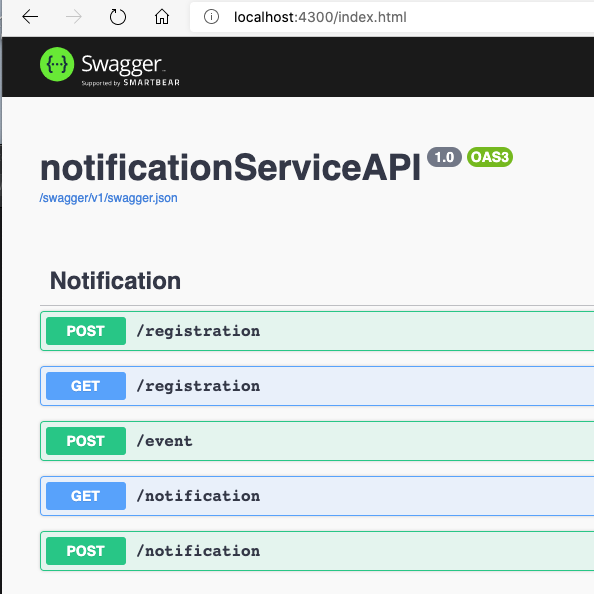
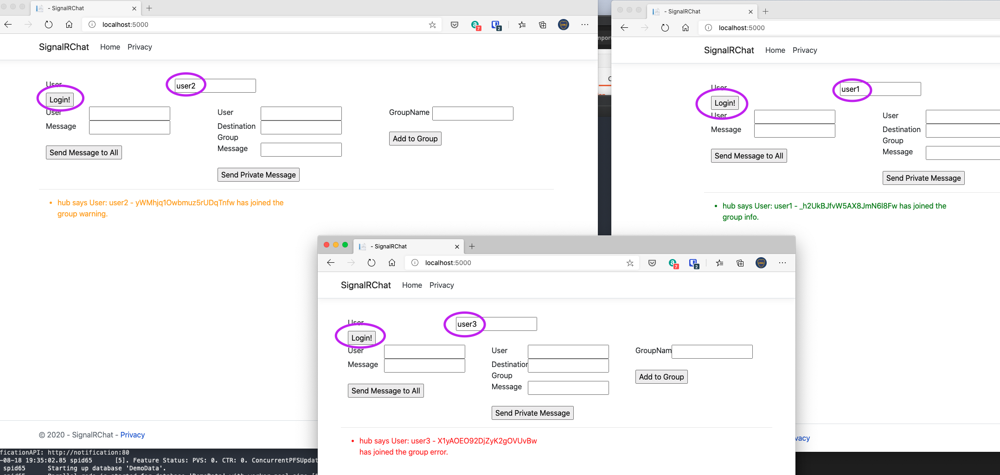
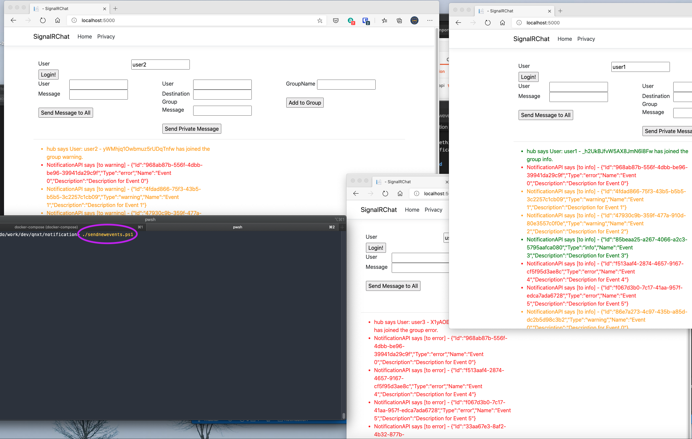

# SignalR Notification PoC

## Introduction

The main intention of the PoC is to determine an approach to control communication efforts between an API and UI final users, to show notifications and keep state of those.

For that purpose, we created 2 projects:
- **SignalRChat**

    This project was based on [this](https://docs.microsoft.com/en-us/aspnet/core/tutorials/signalr?view=aspnetcore-3.1&tabs=visual-studio) demo.

    Basically, this project is being used to do communication through [groups](https://docs.microsoft.com/en-us/aspnet/core/signalr/groups?view=aspnetcore-3.1)

    It has also a functionality to "Log in" a user, which will do a group registration using their connection id, based on information located at the notificationServiceAPI persistence layer.


- **notificationServiceAPI**
  
    This is an asp.net core API, which is communicating with the SignalR Hub, to send notifications.

    This API will keep also information about registrations (users to groups) and to keep update the notification statuses as well (read/unread)

    It's using Redis (with persistence) for notification status tracking, and SQL database for group/users registration data.

## Environment

To test this environment there is a docker-compose file, which can be used to run the environment.

Since we are persisting data from redis and sql, you can delete the environment in case you want to start from scratch.

````bash
docker-compose build #To Build the environment (once or on every code update)

docker-compose up #Run the environment

docker-compose down #Stop with no cleaning the environment (will keep the state)

docker-compose rm #Delete persisted information on SQL server
````

In case you want also to delete Redis persistent information, you can go to the running container and delete all keys:

````bash
>docker ps 

CONTAINER ID        IMAGE                       COMMAND                  CREATED             STATUS              PORTS                    NAMES
14e21b9cb3ce        notification_notification   "dotnet notification…"   34 minutes ago      Up 3 seconds        0.0.0.0:4300->80/tcp     notification_notification_1
e480a9bfceea        notification_spa            "dotnet SignalRChat.…"   37 minutes ago      Up 3 seconds        0.0.0.0:5000->80/tcp     notification_spa_1
0b08218ac450        redis                       "docker-entrypoint.s…"   37 minutes ago      Up 3 seconds        0.0.0.0:6379->6379/tcp   notification_redis_1
9a2487a9f738        notification_sql            "/bin/sh -c '/bin/ba…"   37 minutes ago      Up 3 seconds        0.0.0.0:1433->1433/tcp   notification_sql_1


❯ docker exec -ti 0b0 redis-cli
127.0.0.1:6379> FLUSHALL
OK
127.0.0.1:6379>
````

> In this case 0b0 are the first 3 characters of the container running redis. This is only needed if you want to start with an empty database.


## Testing the environment

Once you do a *docker-compose up*, you will the following endpoints:
- http://localhost:5000 (chat - ui)
- http://localhost:4300 (notification - webapi)
- localhost:6379 (redis)
- localhost:1433 (sql server)

### WebAPI

This API has a Swagger endpoint , where you can see the options:


### registration

Will show or update information about groups where a user is registered

### notification

List notifications for a particular users, or updates notification status (read/unread)

### event

An event is basically something that happened on backend.
An event will fire a notification to the groups registered.

## Script to simulate load

You can run the script called sendnewevents.ps1 to simulate load for users.
As example:



> setup.sql is creating 50 users, from user1..user50

From a console, you can run the script: 



Once you run this script, new notifications will come up to the screens you are using for this test.

> In case you want to simulate new events with no delay, you can run the same script wiht the **-noDelay** parameter


